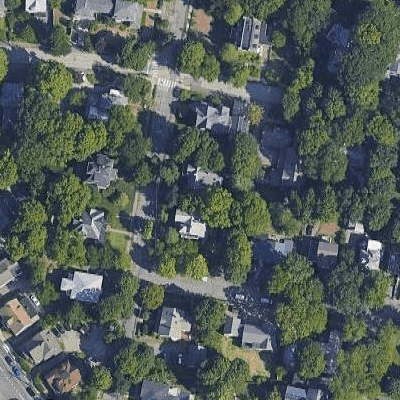
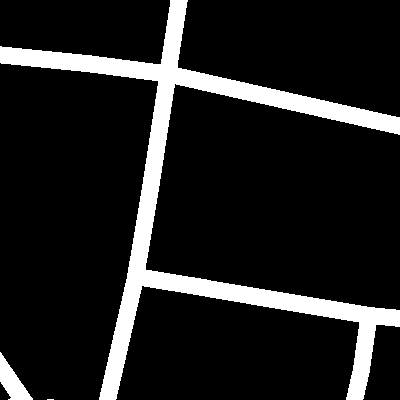
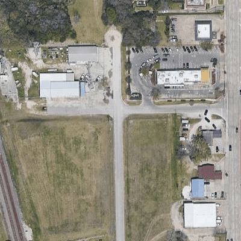
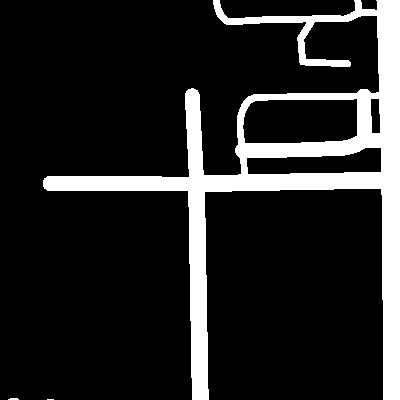
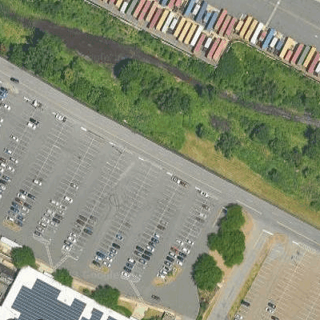
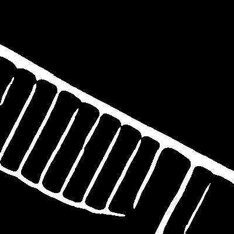
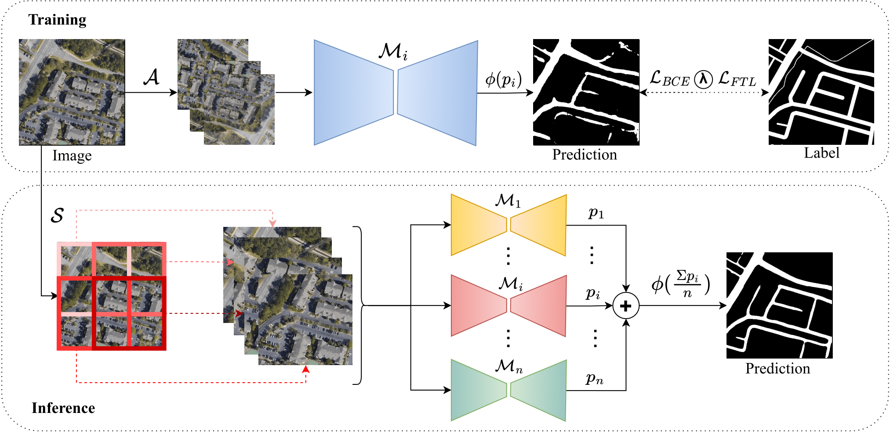

# Road Segmentation Project -[Computational Inteligence Lab. Spring 2023](https://www.vorlesungen.ethz.ch/Vorlesungsverzeichnis/lerneinheit.view?lerneinheitId=167246&semkez=2023S&ansicht=LEHRVERANSTALTUNGEN&lang=en)

## Team

- Ankita Ghosh<sup>*</sup> _[anghosh@student.ethz.ch]_ (22-956-882)
- Ivan Milev<sup>*</sup> _[imilev@student.ethz.ch]_ (22-952-642)
- Sayan Deb Sarkar<sup>*</sup> _[sdebsarkar@student.ethz.ch]_ (22-956-338)
- Siddharth Menon<sup>*</sup> _[menons@student.ethz.ch]_ (22-940-357)

<sup>*</sup> All team members contributed equally.

# A Multi-Model Ensemble For Robust Road Segmentation Using Staged Training

<a href="https://pytorch.org/get-started/locally/"></a>


The goal of the project is to present a solution for automated segmentation of roads from satellite images, 
leveraging the power of Deep Learning techniques. In order to make use of such techniques vast amounts of data are 
require to satisfy this requirement we came up with our own algorithm of collecting correclty labeled data (described below).

Few examples of predictions from our validation dataset are:

|              Input Image               |                Ground Truth                 |                  Prediction                   | 
|:--------------------------------------:|:-------------------------------------------:|:---------------------------------------------:|
|            |    |    |
|         |  |  |
|         |  |  |

In order to achieve these results we came up with the following architecture for training and inference: 



### Networks
This project is based on PyTorch and trained with CUDA.
We are using [Segmentation Models](https://github.com/qubvel/segmentation_models.pytorch) library for the backbones to 
train all our models. To achieve this result we experimented with [UNet++](https://arxiv.org/abs/1807.10165) and [DeepLabV3+](https://arxiv.org/abs/1706.05587)
with weight initialization from [imagenet](https://arxiv.org/abs/1409.0575). The trained architectures based on the above mentioned backbones are
[ResNet](https://arxiv.org/abs/1512.03385) 34, [ResNet](https://arxiv.org/abs/1512.03385) 50, [ResNet](https://arxiv.org/abs/1512.03385) 101, [Inception Net](https://arxiv.org/abs/1409.4842), [Xception](https://arxiv.org/abs/1610.02357), [Efficient Net](https://arxiv.org/abs/1905.11946) b3, [Efficient Net](https://arxiv.org/abs/1905.11946) b4 and [Mobile Net](https://arxiv.org/abs/1704.04861) v2.

Data augmentation is done with the help of the [albumentations library](https://albumentations.ai/) for [PyTorch](https://pytorch.org). 
 

## Setup and Usage

### Requirements
For environment management we've chosen [Anaconda](https://anaconda.org)

In order to initialize our environment with all needed requirements you have to install [conda](https://anaconda.org) and then 
create the environment from `requirements.yaml`:
```bash
conda env create -f requirements.yaml
```

### Our model weights
Model which were trained during the project are available on Google Drive [here](https://drive.google.com/drive/folders/1QMFv-TMrG3yawgh_kruJt7LzG9mU5ePS?usp=sharing).

### Data collection

#### Crawl GMAPS for curating dataset:
In order to make use of our scripts for dataset collection a valid API key has to be set in the environment
of the system. The API key has to be for the Static Maps API, you can get it from the corresponding place in 
the [Google console](https://developers.google.com/maps/documentation/maps-static/overview).
Once you aquire the key you can export it in bash terminal with: ``export GMAPS_KEY=YOUR_API_KEY`` and/or add it
to your `~/.bashrc` and then run `source ~/.bashrc`.

In order to perform dataset collection specify the output directory in the script under the global variable `DATA_FOLDER` and run :
```bash
python data-preprocessing/crawl_aerial_seg.py
```

#### Data Merging (After GMaps Crawling)
Change the paths in ``scripts/merge_data.py`` 

- ``data_root_dir`` : root data directory
- ``kaggle_data_dir`` : data directory for kaggle competiton data
-  ``scraped_data_dir`` : data directory for scraped data, (eg, subdirectories : 1_ZOOM_15, 1_ZOOM_16)
- ``out_data_dir`` : final data directory to be used in training (do not change the name, because we have the config files setup this way)

Change the path in ``scripts/create_splits.py`` - ``data_root_dir`` : root data directory

Run :

```bash
cd scripts
python merge_data.py
python create_splits.py

```

### Training

For the training script it is required to have a valid configuration file(examples in `config\`).
The 
```YAML
seed        : 42
num_workers : 4
log_level   : INFO
log_dir     : PATH/TO/LOGGING/DIRECTORY
data :
  root_dir  : ROOT/DIRECTORY/WHERE/DATA/IS/STORED

train :
  batch_size : batch_size_for_training
  log_every  : log_every_X_steps
  save_every : save_every_Y_epochs
  epochs: number_of_training_epocjs

validation:
  batch_size: validation_batch_size
  valid_every: validation_every_X_epochs

# Loss configuration
loss:
  loss_type: ["ce","ce+ftl", "ce+dice"] # options: ce, dice, ftl, ce+dice, ce+ftl
  epochs: [1,2,5] # [5]
  wlambda: [0.5,0.3,0.5] #[0.5]
  alpha: [0.7,0.7,0.9] #[0.7]
  gamma: [1.5,1.5,1.2] #[1.5]

# WANDB configuration for logging the model training.
wandb:
  wandb: true
  entity: "cil-road-seg-2023"
  project: "trial"
  name: "trial_run_multiloss"
  group: null
  id : "trial_run_multiloss"
```

The `loss` segment of the configuration is defined as follows:
- `loss_type`: possible options are- ce (cross-entropy), dice ([dice loss](https://www.jeremyjordan.me/semantic-segmentation/#loss])), ftl ([focal tversky loss](https://towardsdatascience.com/dealing-with-class-imbalanced-image-datasets-1cbd17de76b5)), ce+dice (a combination of cross-entropy and dice loss) and ce+ftl (a combination of cross entropy and focal tversky loss)
- `wlambda`: activated when using ce+dice or ce+ftl loss_type. wlambda is the weightage given to cross-entropy loss. weightage of the other loss will be 1-wlambda.
- `alpha`: activated when using ftl or ce+ftl loss type. This is a hyperparameter required in focal tversky loss. The higher the alpha value, the more the false negatives are penalised. Weightage to false positives is 1-alpha.
- `gamma`: activated when using ftl or ce+ftl loss type. This is a hyperparameter required in focal tversky loss. Gamma is a parameter that controls the non-linearity of the loss. In the case of class imbalance, the FTL becomes useful when gamma > 1. Gamme < 1 is useful towards the end of training as the model is still incentivised to learn even though it is nearing convergence. 

Running the training pipline:
```bash
cd src
python train.py --config ../configs/base.yaml
```

### Evaluation

In order to evaluate the model on the provided test data we have two scripts:
1. `src/test.py` which will evaluate single model and create submission.csv file which is ready for kaggle submission.
2. `src/test_ensemble.py` which will evaluate and ensemble of provided models with their prediction outputs averaged.

In order to run single model evaluation, configuration in the following format is required:
```YAML
log_level   : INFO
log_dir    : /path/to/log/dir
test :
  test_path : /path/to/test/images
  mask_results_path : /path/to/where/prediction/masks/will/be/saved
  submission_path : /path/to/where/submission/file/will/be/saved
  model_path : /path/to/model/weights/save
  device : which_device_to_be_used(cpu/cuda)
  stride: stride_for_sliding_window
  auto_padding: if_auto_padding_should_be_applied
  padding: padding_value_for_all_sides

```

Before running `test.py` you have to change the encoder_architecture name on line 169, `encoder_name='your_model_encoder_name'`
Running `test.py`:
```bash
cd src
python test.py --config ../configs/base_test.yaml
```

In order to run ensemble model evaluation, following configuration is required:
```YAML
log_level   : INFO
log_dir    : /home/ivan/PycharmProjects/ETH/road-segmentation-ethz-cil-2023/results
test :
  test_path : /path/to/test/images
  test_groundtruth_path : /home/ivan/PycharmProjects/ETH/road-segmentation-ethz-cil-2023/data/seg-data/groundtruth
  mask_results_path : /path/to/where/prediction/masks/will/be/saved
  submission_path : /home/ivan/PycharmProjects/ETH/road-segmentation-ethz-cil-2023/src/output/random_test/test_submit_max_ensemble_256.csv
  model_ensemble_name: [architecture_name_01, architecture_name_02, architecture_name_03]
  model_ensemble_path : [/path/to/model_01/weights/save,/path/to/model_02/weights/save, /path/to/model_02/weights/save ]
  device : which_device_to_be_used(cpu/cuda)
  stride: stride_for_sliding_window
  auto_padding: if_auto_padding_should_be_applied
  padding: padding_value_for_all_sides

```
The test_groundtruth_path is an optional parameter if you want to compute F1-Score, Recall and Precision on the given dataset.
If left blank, we output only masks and submission files.

```bash
cd src
python test.py --config ../configs/base_test.yaml
```
